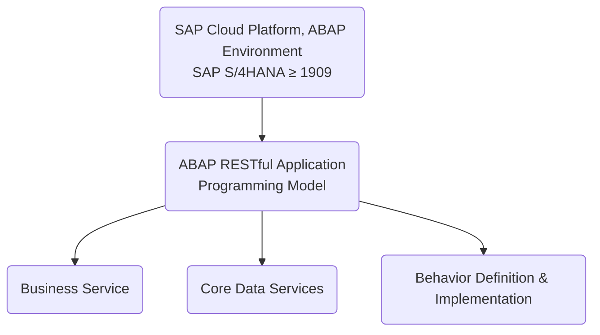
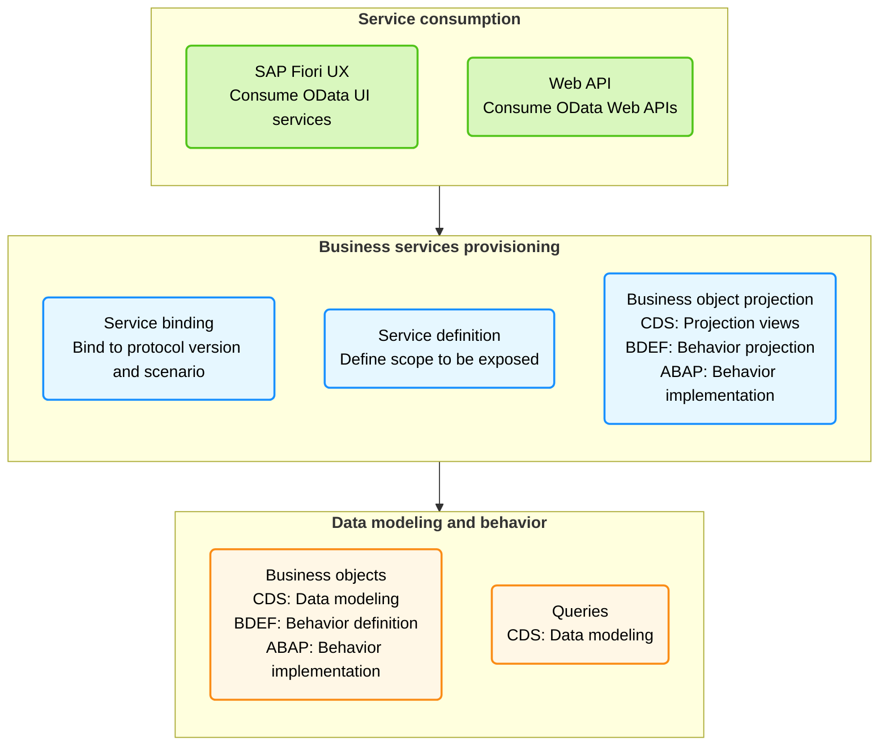

# abap-rap
Exemplo de ABAP RAP

## ABAP RAP - Exemplo de implementação
### O que é ABAP RAP?
O ABAP RAP (Rapid Application Programming) é um modelo de programação que permite o desenvolvimento ágil de aplicações no SAP S/4HANA. Ele combina a flexibilidade do ABAP com as melhores práticas de desenvolvimento moderno, como a utilização de serviços OData e a separação entre lógica de negócios e interface do usuário.

### Exemplo de implementação de um serviço OData utilizando o ABAP RAP (Rapid Application Programming) no SAP S/4HANA.
O exemplo consiste em um serviço OData que permite a criação, leitura, atualização e exclusão de dados de um objeto de negócios (Business Object) chamado "Produto".

### Estrutura do projeto

Uma estrutura típica de projeto ABAP RAP pode incluir os seguintes componentes:

### Steps for RESTful ABAP Programming Model

Below are the typical steps for implementing the RESTful ABAP Programming Model:

1. Create a table.
2. Create an interface view that reads from this table.
3. Create a consumption view that reads from this interface view.
4. Create a metadata extension file.
5. Define entities for Business Object.
6. Define behavior definitions.
7. Implement behavior definitions.
8. Define behavior projections.
9. Define service definition.
10. Define service binding.
11. Optionally – Add draft handling feature.

"Se vi mais longe, foi por estar sobre os ombros de gigantes"
