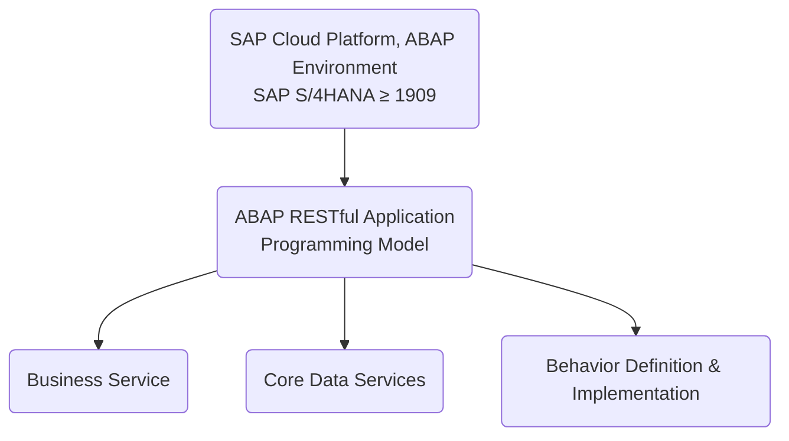
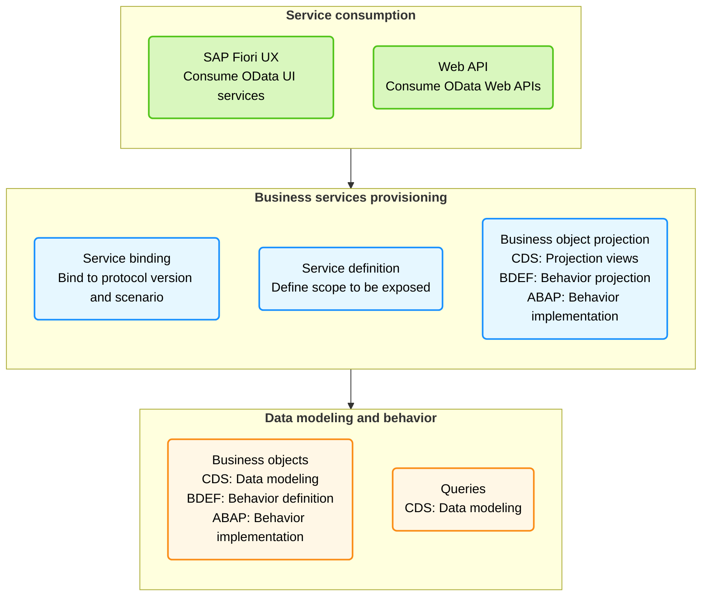
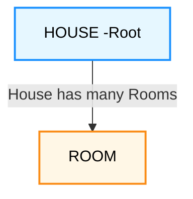
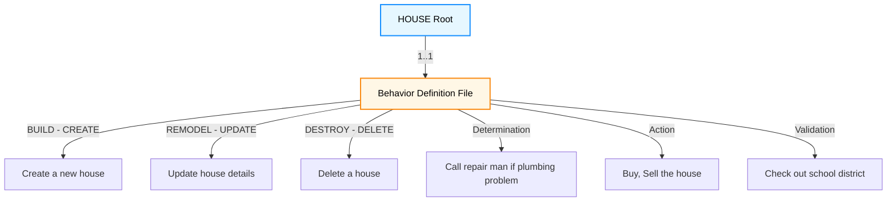

# ABAP Restful Application Programming Model (RAP) 

"Se nada der certo hoje, amanhã eu acordo mais cedo e tento novamente. Até eu conseguir"

---

[](https://github.com/edmilson-nascimento/ABAP-Unit-Tests/network/members)
[](https://github.com/edmilson-nascimento/ABAP-Unit-Tests/stargazers)
[](https://github.com/edmilson-nascimento/ABAP-Unit-Tests/issues)
[](https://github.com/edmilson-nascimento/ABAP-Unit-Tests/blob/main/LICENSE)


## Referências

Este repositório é baseado na lista de reprodução do YouTube:  
[](https://www.youtube.com/playlist?list=PLKSPsENL3CxzRehaCAyH_K0yHM8KwLrDz)  
**RESTful ABAP Programming Model** - Uma série de vídeos que explica o modelo RAP em detalhes.

Para fins de crédito ao autor, este repositório é uma versão em português do conteúdo apresentado na playlist.  
Se você deseja acessar o conteúdo original, visite o canal do autor no YouTube:  
[](https://github.com/miltonchandradas)  
[](https://github.com/miltonchandradas/rapdemo)

## ABAP RAP - Exemplo de implementação
### O que é ABAP RAP?
O ABAP RAP (RESTful Application Programming Model) é um modelo de programação que permite o desenvolvimento ágil de aplicações no SAP S/4HANA. Ele combina a flexibilidade do ABAP com as melhores práticas de desenvolvimento moderno, como a utilização de serviços OData e a separação entre lógica de negócios e interface do usuário.

### Exemplo de implementação de um serviço OData utilizando o ABAP RAP no SAP S/4HANA.
O exemplo consiste em um serviço OData que permite a criação, leitura, atualização e exclusão de dados de um objeto de negócios (Business Object) chamado "Produto".

### Estrutura do projeto

Uma estrutura típica de projeto ABAP RAP pode incluir os seguintes componentes:



### Steps for RESTful ABAP Programming Model

Below are the typical steps for implementing the RESTful ABAP Programming Model:

1. Create a table.
2. Create an interface view that reads from this table.
3. Create a consumption view that reads from this interface view.
4. Create a metadata extension file.
5. Define entities for Business Object.
6. Define behavior definitions.
7. Implement behavior definitions.
8. Define behavior projections.
9. Define service definition.
10. Define service binding.
11. Optionally – Add draft handling feature.

### End-to-End Example

Segue os passos para implementar um exemplo de serviço OData utilizando o ABAP RAP (Rapid Application Programming) no SAP S/4HANA.

#### **Create a package** com nome `ZRAP_EJ`

Crie um pacote no sistema SAP com o nome `ZRAP_EJ` para organizar os objetos do projeto.

#### **Create a table** com nome `ZRAP_UXTEAM_EJ`

Crie uma tabela com o nome `ZRAP_UXTEAM_EJ` contendo os seguintes campos:
   - `id`
   - `firstName`
   - `lastName`
   - `age`
   - `role`
   - `salary`
   - `active`

   

```SQL
@EndUserText.label : 'UX demo table'
@AbapCatalog.enhancement.category : #NOT_EXTENSIBLE
@AbapCatalog.tableCategory : #TRANSPARENT
@AbapCatalog.deliveryClass : #A
@AbapCatalog.dataMaintenance : #ALLOWED
define table zrap_uxteam_ej {

  key client            : abap.clnt not null;
  key id                : sysuuid_x16 not null;
  firstname             : abap.char(100);
  lastname              : abap.char(100);
  age                   : abap.numc(4);
  role                  : abap.char(100);
  salary                : abap.numc(4);
  active                : abap_boolean;
  last_changed_at       : timestampl;
  local_last_changed_at : timestampl;

}
```

####  **Create an interface view** named `ZI_UXTEAM_EJ` that reads from table `ZRAP_UXTEAM_EJ`.

 

 .png)

Neste exemplo, o código da view é o seguinte:
```sql
@AbapCatalog.sqlViewName: 'ZZI_UXTEAM_EJ'
@AbapCatalog.compiler.compareFilter: true
@AccessControl.authorizationCheck: #NOT_REQUIRED
@EndUserText.label: 'Interface view for UX demo'
// @Metadata.ignorePropagatedAnnotations: true
define root view zi_uxteam_ej
  as select from zrap_uxteam_ej
{
  key id                    as Id,
      firstname             as Firstname,
      lastname              as Lastname,
      age                   as Age,
      role                  as Role,
      salary                as Salary,
      active                as Active,
      @Semantics.systemDateTime.lastChangedAt: true
      last_changed_at       as LastChangedAt,
      @Semantics.systemDateTime.localInstanceLastChangedAt: true
      local_last_changed_at as LocalLastChangedAt
}
```

Foi adicionar um **ZZ** no nome da view para evitar conflitos com views padrão do sistema.
```sql
@AbapCatalog.sqlViewName: 'ZZI_UXTEAM_EJ'
```

Todos os campos da tabela sao adicionados na view, exceto os campos `client`, `last_changed_at` e `local_last_changed_at`, que são gerenciados pelo sistema.

```abap
@Semantics.systemDateTime.lastChangedAt: true
last_changed_at       as LastChangedAt,

@Semantics.systemDateTime.localInstanceLastChangedAt: true
local_last_changed_at as LocalLastChangedAt
```
Essas anotações são usadas pelo RAP para controle **automático de versionamento e atualização**.

`last_changed_at`: Momento da última modificação feita em qualquer instância (usado para lock otimista, etc.).

`local_last_changed_at`: Similar, mas referente à instância local (em contextos de objetos compostos).


####  **Create a consumption view** named `ZC_UXTEAM_EJ` that reads from interface view `ZI_UXTEAM_EJ`.

 

 .png)

Neste exemplo, o código da view é o seguinte:
```sql
@EndUserText.label: 'UXTeam Consumption View'
@AccessControl.authorizationCheck: #NOT_REQUIRED
@Search.searchable: true
@Metadata.allowExtensions: true
define root view entity ZC_UXTEAM_EJ
  provider contract transactional_interface
  as projection on zi_uxteam_ej as UXTeam
{
    @EndUserText.label: 'Id'
  key Id,
  @EndUserText.label: 'First Name'
      @Search.defaultSearchElement: true
      Firstname,
      @EndUserText.label: 'Last Name'
      @Search.defaultSearchElement: true
      Lastname,
      @EndUserText.label: 'Age'
      Age,
      @Search.defaultSearchElement: true
      @EndUserText.label: 'Role'
      Role,
      @EndUserText.label: 'Salary'
      Salary,
      @EndUserText.label: 'Active'
      Active,
      LastChangedAt,
      LocalLastChangedAt
}
```
#### **Create a metadata extension file** for UI annotations.
 
 .png)
 .png)

Neste exemplo, o código da metadata extension é o seguinte:
```sql
@Metadata.layer: #CORE

@UI.headerInfo: { typeName: 'UX Team',
                  typeNamePlural: 'UX Team',
                  title: { type: #STANDARD, label: 'UXTeam', value: 'Id' } }

@UI.presentationVariant: [ { sortOrder: [ { by: 'Id', direction: #ASC } ] } ]

annotate view ZC_UXTEAM_EJ with

{
  @UI.facet: [ { id: 'UXDemo',
                 purpose: #STANDARD,
                 type: #IDENTIFICATION_REFERENCE,
                 label: 'UXTeam',
                 position: 10 } ]
  @UI.identification: [ { position: 1, label: 'Id' } ]
  Id;

  @UI.identification: [ { position: 20 } ]
  @UI.lineItem: [ { position: 20 } ]
  @UI.selectionField: [ { position: 20 } ]
  Firstname;

  @UI.identification: [ { position: 30 } ]
  @UI.lineItem: [ { position: 30 } ]
  @UI.selectionField: [ { position: 30 } ]
  Lastname;

  @UI.identification: [ { position: 40 } ]
  @UI.lineItem: [ { position: 40 } ]
  Age;

  @UI.identification: [ { position: 50 } ]
  @UI.lineItem: [ { position: 50 } ]
  Role;

  @UI.identification: [ { position: 60 } ]
  @UI.lineItem: [ { position: 60 } ]
  @UI.selectionField: [ { position: 60 } ]
  Salary;

  @UI.identification: [ { position: 70 },
                        { type: #FOR_ACTION, dataAction: 'setActive', label: 'Set Active' } ]
  @UI.lineItem: [ { position: 70 },
                  { type: #FOR_ACTION, dataAction: 'setActive', label: 'Set Active' } ]
  Active;

  @UI.hidden: true
  LastChangedAt;

  @UI.hidden: true
  LocalLastChangedAt;
}
```

Tambem é possivel e recomendado extrair o metadados de anotações de UI do CDS e criar um arquivo separado para facilitar a manutenção. Para isso, utilize o seguinte exemplo:

 .png)

#### **Define entities for Business Object**

Defina as entidades para o Business Object com as seguintes operações e validações:

1. **`CREATE`, `UPDATE`, `DELETE` operations**:
   - Permitir operações básicas de criação, atualização e exclusão.

2. **Validações durante `CREATE`**:
   - A idade (`age`) deve ser maior que 21.

3. **Ações (`Actions`)**:
   - A flag `active` é definida como `true` após uma série de verificações serem concluídas.

4. **Determinações (`Determinations`)**:
   - Quando o campo `role` é alterado, o campo `salary` também é atualizado automaticamente.

5. **Controle de recursos (`Feature control`)**:
   - O campo `salary` é marcado como somente leitura (`read-only`).

Essas definições são essenciais para garantir que o Business Object siga as regras de negócios e comportamentos esperados no modelo RAP.

Um **Business Object** (Objeto de Negócio) é uma representação lógica de uma entidade de negócios no modelo RAP. Ele pode ser composto por uma hierarquia de nós e conter relações entre entidades.

No exemplo abaixo, temos um **Business Object** chamado `HOUSE` (Casa), que é a entidade raiz, e uma entidade associada chamada `ROOM` (Quarto). A relação entre elas é de composição, ou seja, os quartos não podem existir sem a casa.

- **Hierarchical tree of nodes**: A casa possui muitos quartos.
- **Composition**: Os quartos **não podem existir** sem a casa.
- **HOUSE is the root entity**: A entidade `HOUSE` representa o **Business Object**.

No cenário de ponta a ponta deste exemplo, temos apenas uma única entidade (`UXTEAM`). Para representá-la como um **Business Object**, usamos a palavra-chave `root` no CDS.



#### **Define Behavior Definitions**:
   - Note that `CUD` operations are **FREE**.

#### **Implement Behavior Definitions**.



 .png)

Neste exemplo, o código da metadata extension é o seguinte:
```sql
managed implementation in class zbp_i_uxteam_ej unique;
//strict ( 2 ); //Uncomment this line in order to enable strict mode 2. The strict mode has two variants (strict(1), strict(2)) and is prerequisite to be future proof regarding syntax and to be able to release your BO.

define behavior for zi_uxteam_ej //alias <alias_name>
persistent table zrap_uxteam_ej
lock master
authorization master ( instance )
//etag master <field_name>
{
//  create;
//  update;
//  delete;
//  field ( readonly ) Id;

  create;
  update;
  delete;

  field ( numbering : managed, readonly ) Id;
  field ( readonly ) Active, Salary;
  field ( readonly ) LastChangedAt, LocalLastChangedAt;

  action ( features : instance ) setActive result [1] $self;
  determination changeSalary on save { field Role; }
  validation validateAge on save { field Age; create; }


  mapping for zrap_uxteam_ej
  {
    Id = id;
    FirstName = firstName;
    LastName = lastName;
    Age = age;
    Role = role;
    Salary = salary;
    Active = active;
    LastChangedAt = last_changed_at;
    LocalLastChangedAt = local_last_changed_at;
  }
}


//define behavior for zbp_i_uxteam_ej alias UXTeam
//implementation in class zbp_i_uxteam_5551 unique
//persistent table zrap_uxteam_5551
//// draft table zdr_uxteam_5551
//lock master // total etag LastChangedAt
//etag master LocalLastChangedAt
//{
//  create;
//  update;
//  delete;
//
//  field ( numbering : managed, readonly ) Id;
//  field ( readonly ) Active, Salary;
//  field ( readonly ) LastChangedAt, LocalLastChangedAt;
//
//  action ( features : instance ) setActive result [1] $self;
//  determination changeSalary on save { field Role; }
//  validation validateAge on save { field Age; create; }
//
//
//  mapping for ZRAP_UXTEAM_5551
//  {
//    Id = id;
//    FirstName = firstName;
//    LastName = lastName;
//    Age = age;
//    Role = role;
//    Salary = salary;
//    Active = active;
//    LastChangedAt = last_changed_at;
//    LocalLastChangedAt = local_last_changed_at;
//  }
//}
```


#### **Implement Behavior Definitions**

##### Entity Manipulation Language (EML)

.png)

O **Entity Manipulation Language (EML)** é uma linguagem utilizada no ABAP para consumir diretamente os **Business Objects**. Ele oferece uma maneira segura e eficiente de acessar e modificar dados em cenários transacionais.

Principais características do EML:
- **Business Objects** podem ser consumidos diretamente no ABAP utilizando a sintaxe do EML.
- Proporciona acesso seguro ao tipo (type-safe) para leitura e modificação de dados em cenários de desenvolvimento transacional.
- Possui **3 principais comandos** para manipulação de dados.

O EML é uma ferramenta poderosa no modelo RAP, permitindo que os desenvolvedores interajam diretamente com os **Business Objects** de forma segura e eficiente. Ele simplifica o desenvolvimento de aplicações transacionais ao fornecer uma interface consistente para manipulação de dados.

O **Entity Manipulation Language (EML)** permite manipular entidades diretamente no ABAP. Abaixo estão os comandos disponíveis para a operação `MODIFY`:

```abap
MODIFY ENTITY EntityName
  CREATE [FIELDS ( field1 field2 ... ) WITH] | [FROM] it_instance_c
  CREATE BY \association_name [FIELDS ( field1 field2 ... ) WITH] | [FROM] it_instance_cba
  UPDATE [FIELDS ( field1 field2 ... ) WITH] | [FROM] it_instance_u
  DELETE FROM it_instance_d
  EXECUTE action_name FROM it_instance_a
    [RESULT et_result_a]
    [FAILED ct_failed]
    [MAPPED ct_mapped]
    [REPORTED ct_reported].
```
O **Entity Manipulation Language (EML)** também permite realizar operações de leitura diretamente no ABAP. Abaixo estão os comandos disponíveis para a operação `READ`:

```abap
READ ENTITY EntityName
  [FIELDS ( field1 field2 ... ) WITH] | [FROM] it_instance
  RESULT et_result
  BY \association_name
  [FIELDS ( field1 field2 ... ) WITH] | [FROM] it_instance_rba
  RESULT et_result_rba
  LINK et_link_rba
  [FAILED ct_failed].
```


.png)

Para a implementação do comportamento, crie uma classe de implementação de comportamento (Behavior Implementation Class) que implementa a interface `IF_` e o nome da Behavior Definition.	

A criação da classe de implementação de comportamento é feita através do wizard do ABAP, onde você pode selecionar a Behavior Definition e o sistema irá gerar a estrutura básica da classe.
```abap
CLASS lhc_zi_uxteam_ej DEFINITION INHERITING FROM cl_abap_behavior_handler.
  PRIVATE SECTION.

    METHODS get_instance_features FOR INSTANCE FEATURES
      IMPORTING keys REQUEST requested_features FOR zi_uxteam_ej RESULT result.

    METHODS get_instance_authorizations FOR INSTANCE AUTHORIZATION
      IMPORTING keys REQUEST requested_authorizations FOR zi_uxteam_ej RESULT result.

    METHODS setActive FOR MODIFY
      IMPORTING keys FOR ACTION zi_uxteam_ej~setActive RESULT result.

    METHODS changeSalary FOR DETERMINE ON SAVE
      IMPORTING keys FOR zi_uxteam_ej~changeSalary.

    METHODS validateAge FOR VALIDATE ON SAVE
      IMPORTING keys FOR zi_uxteam_ej~validateAge.

ENDCLASS.

CLASS lhc_zi_uxteam_ej IMPLEMENTATION.

  METHOD get_instance_features.
  ENDMETHOD.

  METHOD get_instance_authorizations.
  ENDMETHOD.

  METHOD setActive.
  ENDMETHOD.

  METHOD changeSalary.
  ENDMETHOD.

  METHOD validateAge.
  ENDMETHOD.

ENDCLASS.
```

Depois dos metodos implementados, passou a ficar da seguinte forma:

```abap
CLASS lhc_zi_uxteam_ej DEFINITION INHERITING FROM cl_abap_behavior_handler.
  PRIVATE SECTION.

    METHODS get_instance_features FOR INSTANCE FEATURES
      IMPORTING keys REQUEST requested_features FOR zi_uxteam_ej RESULT result.

    METHODS get_instance_authorizations FOR INSTANCE AUTHORIZATION
      IMPORTING keys REQUEST requested_authorizations FOR zi_uxteam_ej RESULT result.

    METHODS setActive FOR MODIFY
      IMPORTING keys FOR ACTION zi_uxteam_ej~setActive RESULT result.

    METHODS changeSalary FOR DETERMINE ON SAVE
      IMPORTING keys FOR zi_uxteam_ej~changeSalary.

    METHODS validateAge FOR VALIDATE ON SAVE
      IMPORTING keys FOR zi_uxteam_ej~validateAge.

ENDCLASS.

CLASS lhc_zi_uxteam_ej IMPLEMENTATION.

  METHOD get_instance_features.
  ENDMETHOD.

  METHOD get_instance_authorizations.

    " Read the active flag of the existing members
    READ ENTITIES OF zi_uxteam_ej IN LOCAL MODE
         ENTITY UXTeam
         FIELDS ( Active ) WITH CORRESPONDING #( keys )
         RESULT DATA(members)
         FAILED failed.

    result =
      VALUE #( FOR member IN members

               LET status = COND #( WHEN member-Active = abap_true
                                    THEN if_abap_behv=>fc-o-disabled
                                    ELSE if_abap_behv=>fc-o-enabled  )

               IN


                   ( %tky              = member-%tky
                     %action-setActive = status ) ).

  ENDMETHOD.

  METHOD setActive.

    " Do background check
    " Check references
    " Onboard member

    MODIFY ENTITIES OF zi_uxteam_ej IN LOCAL MODE
           ENTITY UXTeam
           UPDATE
           FIELDS ( Active )
           WITH VALUE #( FOR key IN keys
                         ( %tky   = key-%tky
                           Active = abap_true ) )

           FAILED failed
           REPORTED reported.


    " Fill the response table
    READ ENTITIES OF zi_uxteam_ej IN LOCAL MODE
         ENTITY UXTeam
         ALL FIELDS WITH CORRESPONDING #( keys )
         RESULT DATA(members).

    result = VALUE #( FOR member IN members
                      ( %tky   = member-%tky
                        %param = member ) ).

  ENDMETHOD.

  METHOD changeSalary.

    " Read relevant UXTeam instance data
    READ ENTITIES OF zi_uxteam_ej IN LOCAL MODE
         ENTITY UXTeam
         FIELDS ( Role ) WITH CORRESPONDING #( keys )
         RESULT DATA(members).

    LOOP AT members INTO DATA(member).

      IF member-Role = 'UX Developer'.

        " Change salary to hard coded value
        MODIFY ENTITIES OF zi_uxteam_ej IN LOCAL MODE
               ENTITY UXTeam
               UPDATE
               FIELDS ( Salary )
               WITH VALUE #( ( %tky   = member-%tky
                               Salary = 7000 ) ).

      ENDIF.

      IF member-Role = 'UX Lead'.

        " Change salary to hard coded value
        MODIFY ENTITIES OF zi_uxteam_ej IN LOCAL MODE
               ENTITY UXTeam
               UPDATE
               FIELDS ( Salary )
               WITH VALUE #( ( %tky   = member-%tky
                               Salary = 9000 ) ).

      ENDIF.

      IF member-Role = 'ABAP'.

        " Change salary to hard coded value
        MODIFY ENTITIES OF zi_uxteam_ej IN LOCAL MODE
               ENTITY UXTeam
               UPDATE
               FIELDS ( Salary )
               WITH VALUE #( ( %tky   = member-%tky
                               Salary = 3000 ) ).

      ENDIF.

      IF member-Role = 'ABAP Cloud'.

        " Change salary to hard coded value
        MODIFY ENTITIES OF zi_uxteam_ej IN LOCAL MODE
               ENTITY UXTeam
               UPDATE
               FIELDS ( Salary )
               WITH VALUE #( ( %tky   = member-%tky
                               Salary = 4000 ) ).

      ENDIF.

    ENDLOOP.

  ENDMETHOD.

  METHOD validateAge.

    READ ENTITIES OF zi_uxteam_ej
         IN LOCAL MODE
         ENTITY UXTeam
         FIELDS ( Age ) WITH CORRESPONDING #( keys )
         RESULT DATA(members).

    LOOP AT members INTO DATA(member).

      IF member-Age < 21.
        " Does not continue anymore | failed
        APPEND VALUE #( %tky = member-%tky ) TO failed-uxteam.
        " Recomendo even you not use draft | %tky | Table Key
      ENDIF.

    ENDLOOP.

  ENDMETHOD.

ENDCLASS.
```

#### **Define Behavior Projections**:
   - Project all behaviors except `DELETE`.

#### **Define Service Definition**.

#### **Define Service Binding**:
    - `OData V2` with UI annotations.
    - `OData V2` without Fiori element app.

#### **Add draft handling functionality**.

