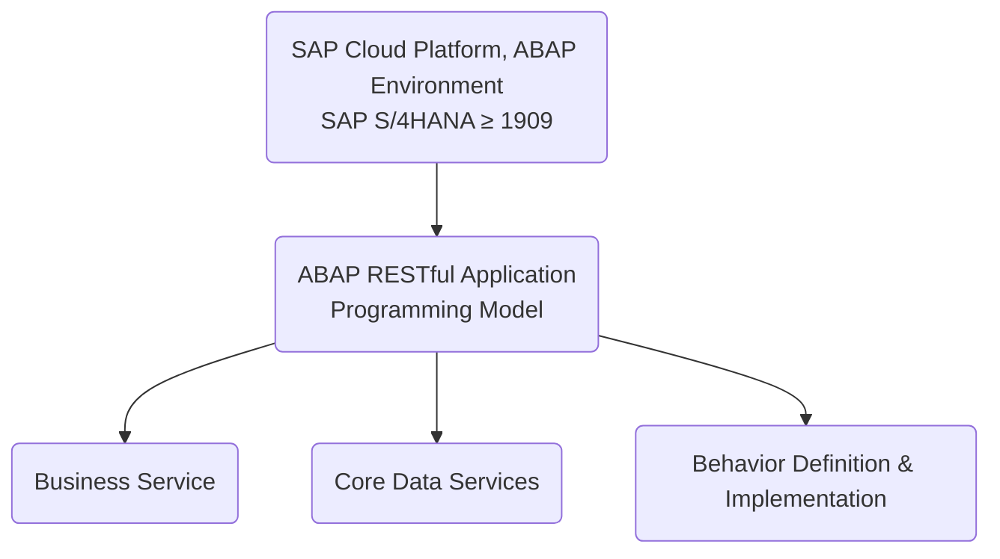
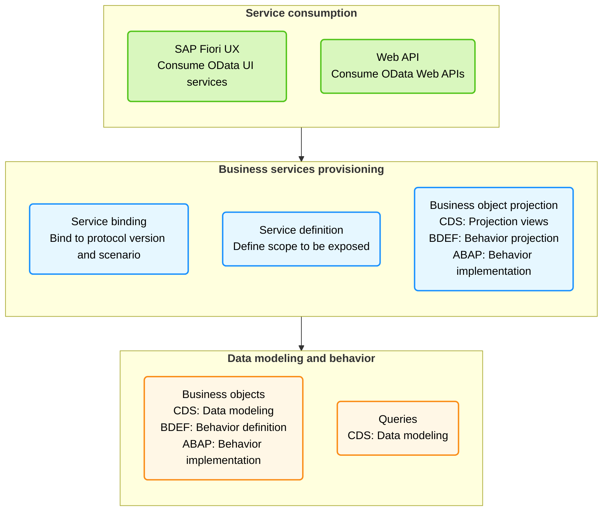

# ABAP Restful Application Programming Model (RAP) 

"Se nada der certo hoje, amanhã eu acordo mais cedo e tento novamente. Até eu conseguir"

---

Este repositório é baseado na lista de reprodução do YouTube [RESTful ABAP Programming Model](https://www.youtube.com/playlist?list=PLKSPsENL3CxzRehaCAyH_K0yHM8KwLrDz).  
Para fins de crédito ao autor, este repositório é uma versão em português do conteúdo apresentado na playlist.  
Se você deseja acessar o conteúdo original, visite o canal do autor no YouTube.

[](https://github.com/edmilson-nascimento/ABAP-Unit-Tests/network/members)
[](https://github.com/edmilson-nascimento/ABAP-Unit-Tests/stargazers)
[](https://github.com/edmilson-nascimento/ABAP-Unit-Tests/issues)
[](https://github.com/edmilson-nascimento/ABAP-Unit-Tests/blob/main/LICENSE)


## ABAP RAP - Exemplo de implementação
### O que é ABAP RAP?
O ABAP RAP (Rapid Application Programming) é um modelo de programação que permite o desenvolvimento ágil de aplicações no SAP S/4HANA. Ele combina a flexibilidade do ABAP com as melhores práticas de desenvolvimento moderno, como a utilização de serviços OData e a separação entre lógica de negócios e interface do usuário.

### Exemplo de implementação de um serviço OData utilizando o ABAP RAP (Rapid Application Programming) no SAP S/4HANA.
O exemplo consiste em um serviço OData que permite a criação, leitura, atualização e exclusão de dados de um objeto de negócios (Business Object) chamado "Produto".

### Estrutura do projeto

Uma estrutura típica de projeto ABAP RAP pode incluir os seguintes componentes:


### Steps for RESTful ABAP Programming Model

Below are the typical steps for implementing the RESTful ABAP Programming Model:

1. Create a table.
2. Create an interface view that reads from this table.
3. Create a consumption view that reads from this interface view.
4. Create a metadata extension file.
5. Define entities for Business Object.
6. Define behavior definitions.
7. Implement behavior definitions.
8. Define behavior projections.
9. Define service definition.
10. Define service binding.
11. Optionally – Add draft handling feature.

### End-to-End Example

Below are the detailed steps for implementing an end-to-end example in the RESTful ABAP Programming Model:

Segue os passos para implementar um exemplo de serviço OData utilizando o ABAP RAP (Rapid Application Programming) no SAP S/4HANA.

0. **Create a package** com nome `ZRAP_EJ`.

1. **Create a table** com nome `ZRAP_UXTEAM_EJ` with the following fields:
   - `id`
   - `firstName`
   - `lastName`
   - `age`
   - `role`
   - `salary`
   - `active`

   

```SQL
@EndUserText.label : 'UX demo table'
@AbapCatalog.enhancement.category : #NOT_EXTENSIBLE
@AbapCatalog.tableCategory : #TRANSPARENT
@AbapCatalog.deliveryClass : #A
@AbapCatalog.dataMaintenance : #ALLOWED
define table zrap_uxteam_ej {

  key client            : abap.clnt not null;
  key id                : sysuuid_x16 not null;
  firstname             : abap.char(100);
  lastname              : abap.char(100);
  age                   : abap.numc(4);
  role                  : abap.char(100);
  salary                : abap.numc(4);
  active                : abap_boolean;
  last_changed_at       : timestampl;
  local_last_changed_at : timestampl;

}
```

2. **Create an interface view** named `ZI_UXTEAM_EJ` that reads from table `ZRAP_UXTEAM_EJ`.

 

 .png.png)

Neste exemplo, o código da view é o seguinte:
```sql
@AbapCatalog.sqlViewName: 'ZZI_UXTEAM_EJ'
@AbapCatalog.compiler.compareFilter: true
@AccessControl.authorizationCheck: #NOT_REQUIRED
@EndUserText.label: 'Interface view for UX demo'
// @Metadata.ignorePropagatedAnnotations: true
define view zi_uxteam_ej
  as select from zrap_uxteam_ej
{
  key id                    as Id,
      firstname             as Firstname,
      lastname              as Lastname,
      age                   as Age,
      role                  as Role,
      salary                as Salary,
      active                as Active,
      @Semantics.systemDateTime.lastChangedAt: true
      last_changed_at       as LastChangedAt,
      @Semantics.systemDateTime.localInstanceLastChangedAt: true
      local_last_changed_at as LocalLastChangedAt
}
```
Todos os campos da tabela sao adicionados na view, exceto os campos `client`, `last_changed_at` e `local_last_changed_at`, que são gerenciados pelo sistema.

Foi adicionar um **ZZ** no nome da view para evitar conflitos com views padrão do sistema.
```sql
@AbapCatalog.sqlViewName: 'ZZI_UXTEAM_EJ'
```

Notas:
```abap
@Semantics.systemDateTime.lastChangedAt: true
last_changed_at       as LastChangedAt,

@Semantics.systemDateTime.localInstanceLastChangedAt: true
local_last_changed_at as LocalLastChangedAt
```
Essas anotações são usadas pelo RAP para controle **automático de versionamento e atualização**.

`last_changed_at`: Momento da última modificação feita em qualquer instância (usado para lock otimista, etc.).

`local_last_changed_at`: Similar, mas referente à instância local (em contextos de objetos compostos).


3. **Create a consumption view** named `ZC_UXTEAM` that reads from interface view `ZI_UXTEAM`.

4. **Create a metadata extension file** for UI annotations.

5. **Define entities for Business Object**:
   - `CREATE`, `UPDATE`, `DELETE` operations.
   - Validations during `CREATE` – Age should be greater than 21.
   - Actions – Active flag is set to true after a series of checks are complete.
   - Determination – When `Role` is changed, we change the `Salary`.
   - Feature control – `Salary` is marked read-only.

6. **Define Behavior Definitions**:
   - Note that `CUD` operations are **FREE**.

7. **Implement Behavior Definitions**.

8. **Define Behavior Projections**:
   - Project all behaviors except `DELETE`.

9. **Define Service Definition**.

10. **Define Service Binding**:
    - `OData V2` with UI annotations.
    - `OData V2` without Fiori element app.

11. **Add draft handling functionality**.

"Se nada der
certo hoje,
amanhã eu
acordo mais
cedo e tento
novamente.
Até eu conseguir"
